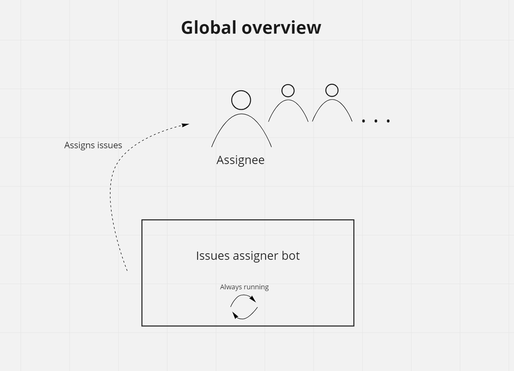
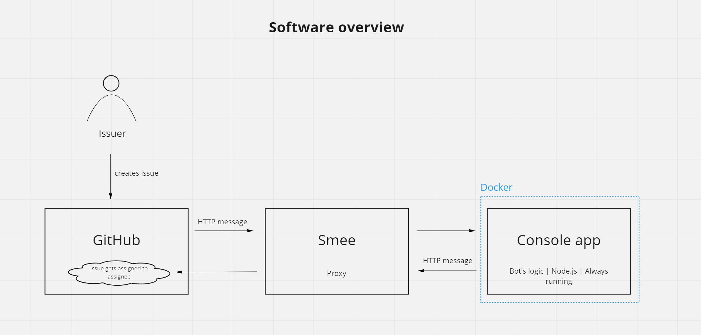
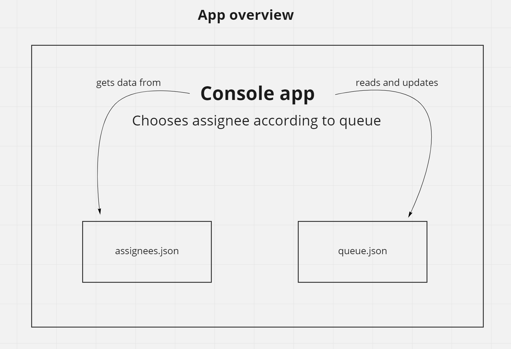

# PAYONE GitHub issues assigner bot
This is a GitHub bot that assigns assignees to newly created issues.

The app uses GitHub's API, GitHub's framework Probot, GitHub's webhook proxy Smee
to listen for 'new issue' event, Node.js as the language; also, this app
could be run inside a Docker container.

## Overview diagrams
### Global overview

### Software overview

### App overview


## Text overview
This app should be run continuously like a daemon. Fortunately,
Probot handles this - we just need to issue `npm run start` command.

The assignees' data is grabbed from `assignees.json` file and the
assignees are chosen according to a queue which is described in
file `queue.json`. This file just keeps track of who will be the next
assignee via `_index` property. So, if you want to manually set up
another assignee, just update the `_index` property. Note: this property
uses zero-based index, so, the first person will be under index `0`,
the second - under index `1`, and so forth.

The main script in the project is `index.js` - this where the logic for 
the bot resides. The code is pretty straightforward. If you want to check
the docs for Probot, check the official docs [here](https://probot.github.io/docs/README/)

Also, as for the code in `index.js`, I've intentionally left `getRandomAssignee()`
function just in case. Maybe, somebody would like the bot to randomly assign
assignees.

## Running the bot
First of all, we'll need to provide `.env` file with the needed credentials
and data.

### Development
To develop, you only need to change `index.js` and then run the bot via
`npm run start` or via Docker with `docker-compose up -d`. Then the bot 
will listen for new issues 🙂

### Deployment
To deploy, as was stated earlier, populate the `.env` file and run the bot via `npm run start`
or via Docker with `docker-compose up -d`. Then the bot
will listen for new issues 🙂

##### A note on using Git and Git password
Most probably you will need to set up a token to pull from the GitHub origin
repository. I.e., when you want to update the deployed project (pull the changes),
GitHub will ask you this:
```
Password for 'https://AlexDz27@github.com': 
```
And here, instead of your password, you should use a token that you can set up
by following [this doc](https://docs.github.com/en/authentication/keeping-your-account-and-data-secure/creating-a-personal-access-token).

### Notes on Docker
When running Docker, be careful about the ports - the current mapping is 
`3010:3000`. It means that the app would run on port `3010` on the
host machine.

## Notes
### On queue.json
#### Changing queue.json (information for assignees)
If you want to deactivate your turn in the queue (if you go on a vacation or something like that), simply edit `assignees.json` file - 
just put `"active": false` instead of `true` in your entry, and that's all. The work to properly compute
the next assignee is done automatically (or, how Andre likes to say, automagically 🙂) by `getAssigneeFromQueue()`
function.

If you want to change the turn of the queue, (i.e. right now is the turn of Joe, the next is Jane - and you want
Jane to be the next assignee), you only need to change `_index` property inside `queue.json` file. For example, if `_index`
was `2`, then you need to change it to `3`. You can only change this property, you don't need to change `name` field.

#### Why is queue.json being unchanged in Git? 
File `queue.json` is being tracked inside Git via `git update-index --assume-unchanged <file>`
command. It means that this if file gets changed, the changes are not seen by Git.

This allows us to develop the project without polluting Git's staging area with
constantly updating `queue.json` file.